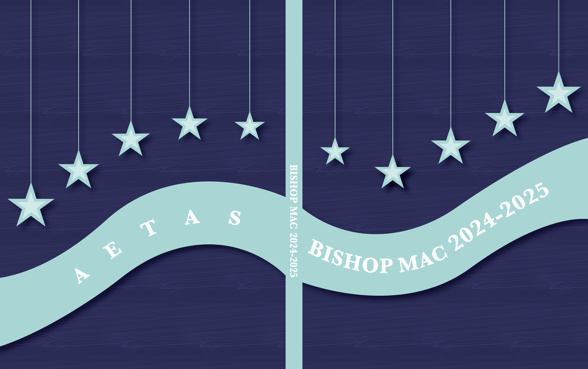
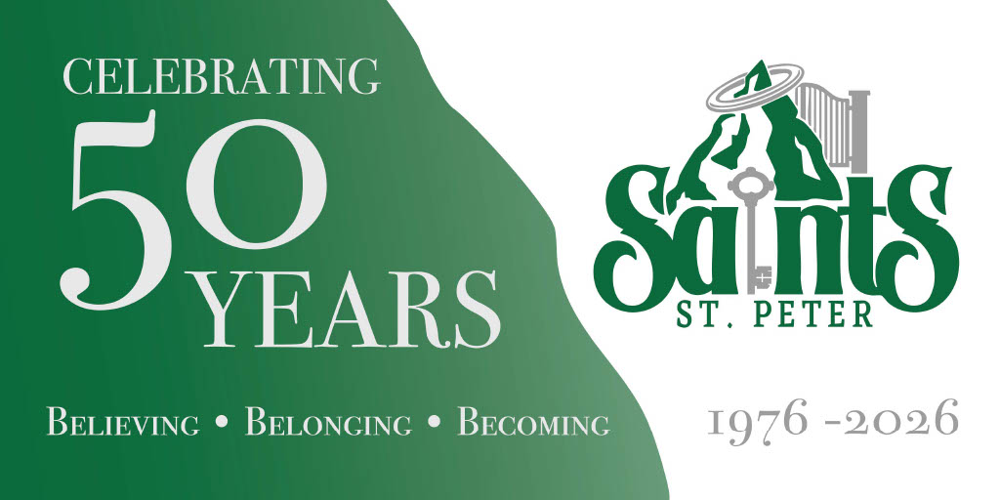

# Home Page

This is my home page

## About Me

My name is **Lauren**. I am a graphic designer.

## Education

I am in the Graphic Design program. I go to _Humber_ college. I am in my second year of the program.

## Projects

Down below are some projects I have worked on during my time as a Humber student.

### Yearbook Cover

The first one is the yearbook cover I designed during High School. My design was used for the 2024-2025 yearbook.

### Banner

In high school I was it M&T for a semester. I worked on some projects that would be used for places such as the Wellington Catholic District school board. One project was creating a banner for the 50th anniversary for St. Peter. My design ended up being used for the banner *minus the school logo and 1976-2026 text*. 

### Album Cover

This was one of the first class collaborative projects I worked on in college. For this project I designed album covers for a made up band based on a theme.

![
